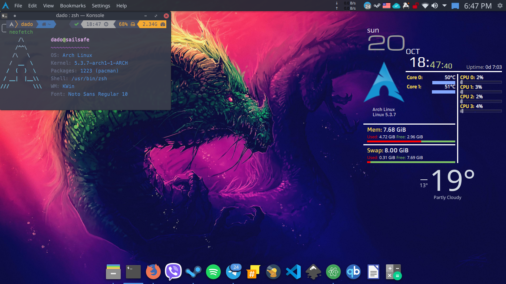

  
# Maintaining my dotfiles, feel free to use!

### Maintaining my dotfiles, feel free to use!:octocat:

  
### Arch Linux [GNOME]

**This setup is all about simple customization, clean look, full functionality, it's designed by me for me.
I am using this set up for so long, but I am open for changes but I am not comfy doing them.**

** GTK Theme **

| Theme                                                  | Description                                                      |
|----------------------------------------------------------|------------------------------------------------------------------|
| [Soho vibes for GTK ](https://github.com/rose-pine/gtk)                 | The best GTK theme!                                            |

**Shell information:**

| Package                                                  | Description                                                      |
|----------------------------------------------------------|------------------------------------------------------------------|
| [Arch Linux](https://www.archlinux.org/)                 | The best distro ever!                                            |
| [Zsh](https://github.com/zsh-users/zsh)                  | The most powerful shell out there!                               |
| [neofetch](https://github.com/dylanaraps/neofetch)       | A fast, highly customizable system info script                   |
| [Nerd Fonts](https://github.com/ryanoasis/nerd-fonts)    | Fonts patched with lots of amazing icons (I use Nato sans)       |
